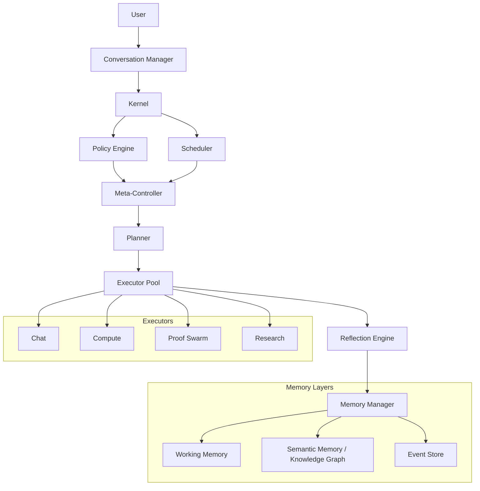

# Cognitive Operating System — Final Blueprint

This final blueprint transitions the Mathematical OS from an LLM-centric proof engine into a modular, event-sourced Cognitive Runtime where the LLM is just one computational resource among many.

## 1. The Kernel & Policy Engine (Deterministic First)
Routing will not rely on an LLM for every query. The `Kernel` will use a **Policy Engine** for deterministic triage.
- **Static Rules:** e.g., if regex matches a simple math expression (`2+2`), route to `Compute`.
- **Heuristics:** e.g., if query length < 5 words and contains greetings, route to `Chat`.
- **LLM Fallback:** Only if rules and heuristics fail to classify the intent confidently, invoke the LLM classifier.

## 2. Resource Scheduler
The **Scheduler** will sit below the Kernel to manage physical and financial constraints.
- **Responsibilities:** Budgets, token allocations, model selection, concurrency limits, and timeout policies.
- It decouples the *decision of what to do* (Planner) from the *logistics of doing it* (Scheduler).

## 3. Evidence-Based Confidence Escalation
The `Meta-Controller` will dictate escalation not based on LLM intuition, but on measurable signals.
- **Confidence Function:** `f(query_complexity, retrieval_quality, tool_success, knowledge_coverage)`
- If confidence drops below threshold during a fast execution path, it escalates to heavy machinery (e.g., Librarian retrieval -> Swarm Proof Executor).

## 4. Stateless Executors
The monolithic `solver.py` will be broken into an **Executor Pool**:
- `Chat`, `Explain`, `Compute`, `Proof`, `Research`, `Programming`, `Simulation`.
- **Pure Functions:** Executors will take Inputs and return Outputs. They will have *no side effects*. All database writes and memory updates will be handled by the Kernel and Memory Manager.

## 5. Layered Memory Architecture
Memory will be partitioned like a modern hardware stack:
- **Event Memory (SSD):** Immutable ledger of all system events (User queries, Tool calls, Syntheses).
- **Semantic Memory (Knowledge Graph):** Persistent, structured extracted knowledge.
- **Working Memory (RAM):** The currently active context window and conversation thread.

## 6. Mathematical Knowledge Graph & Provenance
The `Librarian` and `InductionEngine` will extract a true Knowledge Graph, not just lists of axioms.
- **Nodes:** Definition, Theorem, Proof, Algorithm, Identity, Counterexample.
- **Edges:** `used_by`, `proved_by`, `generalizes`, `requires`.
- **Provenance:** Every extracted node will have strict metadata (ID, Source Document, Edition, Extraction Date, Confidence) to handle conflicts and versioning cleanly.

## 7. Reflection Engine
A post-execution evaluation stage.
- Analyzes the execution: *Did retrieval help? Was the swarm necessary? Should an algorithm be cached?*
- Passes lessons back to the `Memory Manager` to optimize future orchestration.

---

### End-to-End System Architecture

> [!IMPORTANT]
> **User Review Required:**
> This captures the complete, modular OS paradigm shift. If this architecture looks correct to you, we can transition from Planning to Execution. I will start by refactoring the `database.py` to support the Layered Memory and Event Store, and then build the central `kernel.py` routing hub.
> 
> May we begin execution?
